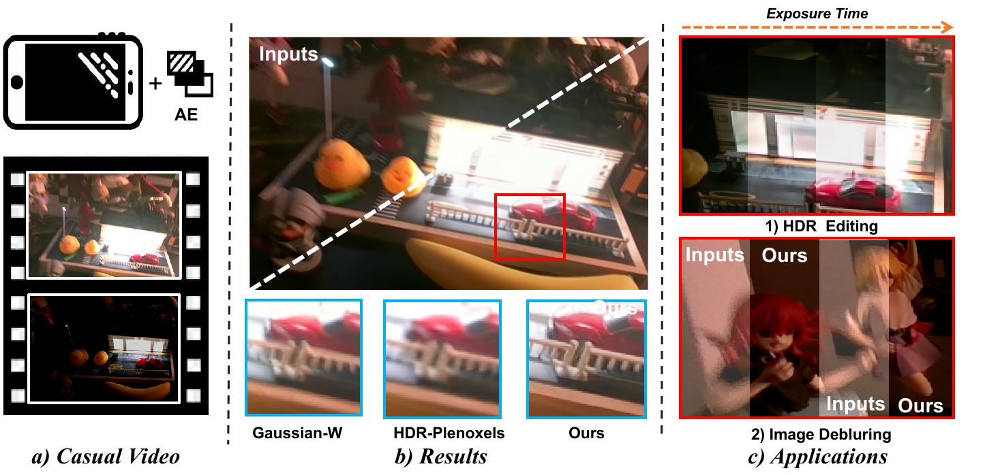
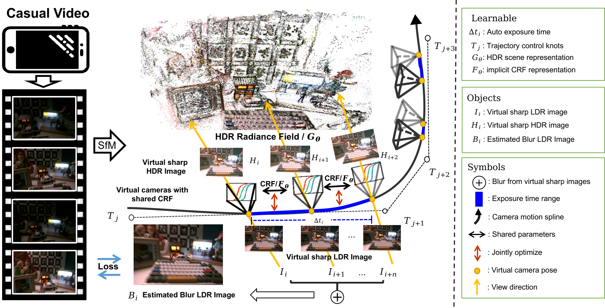

<h2 align="center">CasualHDRSplat: Robust High Dynamic Range 3D Gaussian Splatting from
Casually Captured Videos    
ArXiv 2025</h2>

    <a href="https://github.com/TeaDrinkingGong">Shucheng Gong</a>1,2* &emsp;&emsp;
    <a href="https://github.com/LingzheZhao">Lingzhe Zhao</a>1* &emsp;&emsp;
    <a href="https://akawincent.github.io">Wenpu Li</a>1* &emsp;&emsp;
    Xiang Liu1,3 &emsp;&emsp;  
    Yin Zhang1,4 &emsp;&emsp;
    Shiyu Zhao1 &emsp;&emsp;
    Hong Xie2 &emsp;&emsp;
    <a href="https://ethliup.github.io/">Peidong Liu</a>1†

    *equal contribution &emsp;&emsp; † denotes corresponding author.

    1Westlake University &emsp;&emsp;
    2Wuhan University &emsp;&emsp;
    3ETH Zürich &emsp;&emsp;
    4Zhejiang University &emsp;&emsp;

<h5 align="center">

<!-- 
 
 
 

  
 -->

</h5>

    

> a) Our method can reconstruct 3D HDR scenes from videos casually captured with auto-exposure enabled. b) Our approach achieves superior rendering quality compared to methods like Gaussian-W and HDR-Plenoxels. c) After 3D HDR reconstruction, we can not only synthesize novel view, but also perform various downstream tasks, such as 1) HDR exposure editing, 2) Image deblurring.

## 📋 Pipeline

    

Given a casually captured video with auto exposure, camera motion blur, and significant exposure time changes, we train 3DGS to reconstruct an HDR scene. We design a unified model based on the physical image formation process, integrating camera motion blur and exposure-induced brightness variations. This allows for the joint estimation of camera motion, exposure time, and camera response curve while reconstructing the HDR scene. After training, our method can sharpen the train images and render HDR and LDR images from specified poses.

## 🛠️  Still working on....

